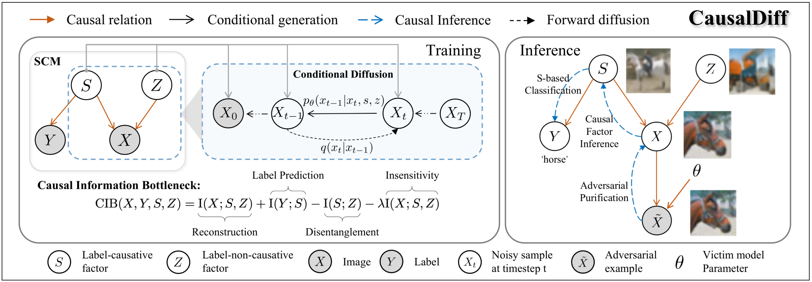

# CausalDiff
<p align="center">

Official PyTorch implementation of the NeurIPS 2024 paper:<br>

[CausalDiff: Causality-Inspired Disentanglement via Diffusion Model for Adversarial Defense](https://arxiv.org/abs/2410.23091)

<br>

MingKun Zhang, Keping Bi, Wei Chen, Quanrun Chen, Jiafeng Guo, Xueqi Cheng<br>

https://github.com/ZhangMingKun1/CausalDiff <br>  

</p>


Abstract: *Despite ongoing efforts to defend neural classifiers from adversarial attacks, they remain vulnerable, especially to unseen attacks. In contrast, humans are difficult to be cheated by subtle manipulations, since we make judgments only based on essential factors. Inspired by this observation, we attempt to model label generation with essential label-causative factors and incorporate label-non-causative factors to assist data generation. For an adversarial example, we aim to discriminate the perturbations as non-causative factors and make predictions only based on the label-causative factors. Concretely, we propose a casual diffusion model (CausalDiff) that adapts diffusion models for conditional data generation and disentangles the two types of casual factors by learning towards a novel casual information bottleneck objective. Empirically, CausalDiff has significantly outperformed state-of-the-art defense methods on various unseen attacks, achieving an average robustness of 86.39\% (+4.01\%) on CIFAR-10, 56.25\% (+3.13\%) on CIFAR-100, and 82.62\% (+4.93\%) on GTSRB (German Traffic Sign Recognition Benchmark).*


## Requirements

The code is achieved with Python 3.7.13. To install the required packages, run:

  ```bash

  pip install -r requirements.txt

  ```


\## Pre-trained CausalDiff

Note that you have to put all the datasets in the `datasest` directory.


For the trained CausalDiff model on CIFAR-10, you can download them from the following links:


- CausalDiff for CIFAR-10: [download link](https://drive.google.com/file/d/16_-Ahc6ImZV5ClUc0vM5Iivf8OJ1VSif/view?usp=sharing)


Note that you have to put the pre-trained model in the `checkpoints` directory.


## Run experiments on CIFAR-10


### Train CausalDiff


- To train a CausalDiff on CIFAR-10 dataset:


```bash

bash run.sh

```


### AutoAttack Linf


- To get results of defending against AutoAttack Linf:


```bash

bash run_eval.sh # AutoAttack Linf wiith eps=8/255

```


This work may be used non-commercially, meaning for research or evaluation

purposes only. For business inquiries, please contact [zhangmingkun20z@ict.ac.cn](zhangmingkun20z@ict.ac.cn).


## Citation


Please cite our paper, if you happen to use this codebase:

```
@article{zhang2024causaldiff,
  title={CausalDiff: Causality-Inspired Disentanglement via Diffusion Model for Adversarial Defense},
  author={Zhang, Mingkun and Bi, Keping and Chen, Wei and Chen, Quanrun and Guo, Jiafeng and Cheng, Xueqi},
  journal={arXiv preprint arXiv:2410.23091},
  year={2024}
}
```
